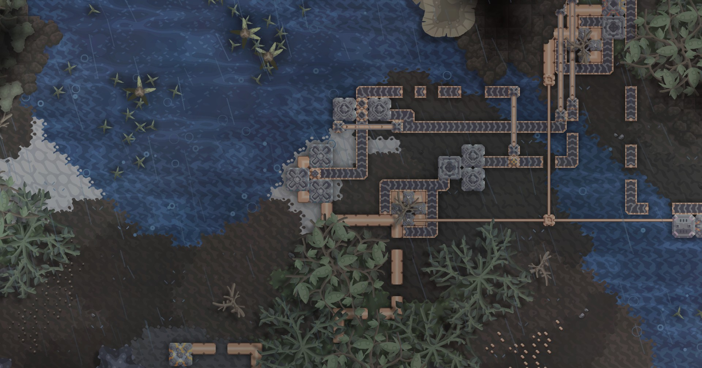

# Project Reindustrialization

ProjReind is the improved version of my previous mod [Reindustrialization](https://github.com/HuanXefh/Reindustrialization). It focuses on hardcore production instead of tower defense, and the tech tree differs vastly in style from vanilla ones. Most of the factories in ProjReind are multi-crafters, and there's a hell amount of recipes combined together as production routes. The mod also introduces new mechanics like pipe corrosion and fuel heat.

ProjReind requires [Lovecraftian Library](https://github.com/HuanXefh/Lovecraftian-Library) and [Lovecraftian Laboratory](https://github.com/HuanXefh/Lovecraftian-Laboratory) to function normally. The mod is always unfinished and there's no end-game stage.

If you'd like to report bugs or share some ideas, please submit issues at [Lovecraftian Library](https://github.com/HuanXefh/Lovecraftian-Library) where majority of the scripts are written.
