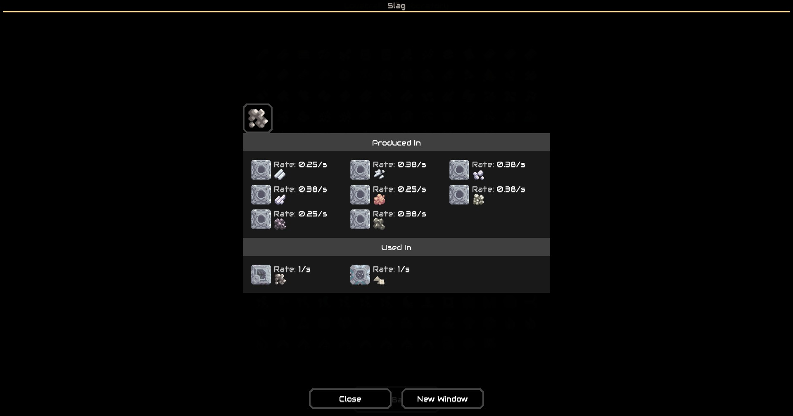
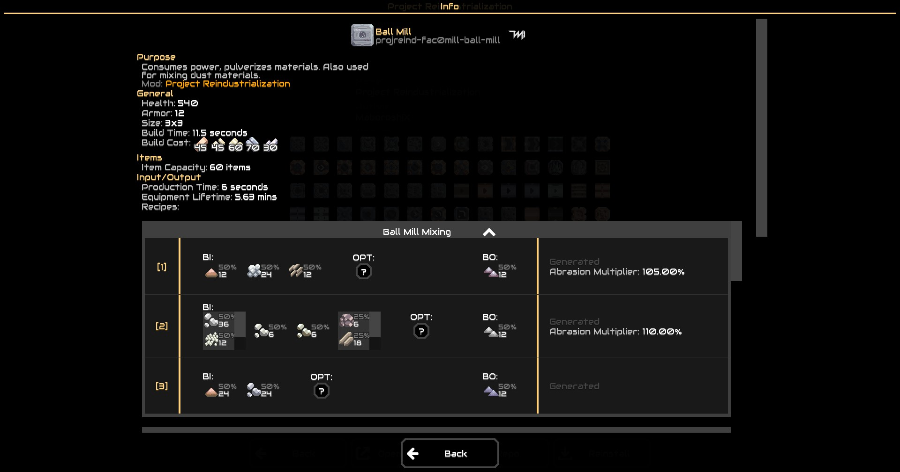

# Project Reindustrialization

<del>Welcome to Mindustry Educational Edition.</del>

 

- [Discord](https://discord.com/channels/391020510269669376/1346118807734845440)

- [Trello](https://trello.com/invite/b/69f36fa2ecd73734b4e1b3f6/ATTIedebb1c53725211faa72a13293371bd4F56B312C/projreind-todos)

 

Project Reindustrialization (ProjReind) is a Mindustry JavaScript mod without tower defense. Instead, the mod brings realistic and hardcore production, and multi-crafters equipped with a hell amount of recipes for Greg's Tech enjoyers.

 

ProjReind is the improved version of [Reindustrialization](https://github.com/HuanXefh/Reindustrialization) with codes and contents refined. The mod requires [Lovecraftian Library](https://github.com/HuanXefh/Lovecraftian-Library-Java) and [Lovecraftian Laboratory](https://github.com/HuanXefh/Lovecraftian-Laboratory).

Mod features:

- Multi-crafters and a complex net of recipes based on real-life processes.

- Peaceful sectors (at most time) with mass production as the only objective.

- Tech tree with style entirely distinct from vanilla Mindustry.

- Various mechanics including furnace temperature, corrosion and pollution.

- [TMI](https://github.com/EB-wilson/TooManyItems) support, which is recommended for better experience.

**This single mod is only responsible for adding various blocks and the campaign maps.** If you'd like to report bugs or share ideas, please submit issues at [Lovecraftian Library](https://github.com/HuanXefh/Lovecraftian-Library-Java) where majority of the scripts are written.
